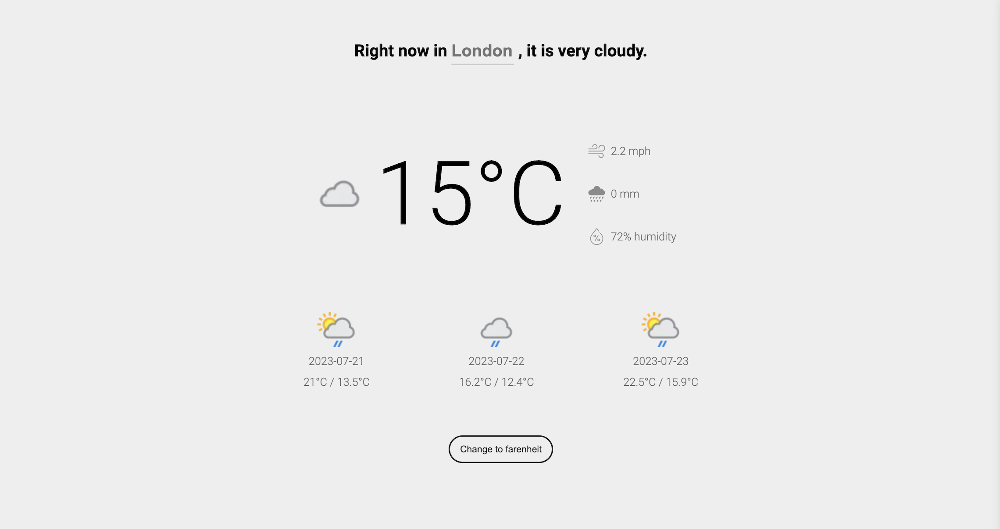

# Weather App - Vanilla JavaScript

This is a simple weather app built with HTML, CSS, and Vanilla JavaScript that allows users to retrieve the current weather information and a 3-day forecast for any city across the world. The main purpose of this project is to demonstrate and practice using APIs to fetch data and display it in a user-friendly manner.

## How to Use

1. **Input City** : On the app's homepage, you'll find a text input field where you can enter the city name for which you want to check the weather. Optionally, you can include the state/province/country (for cities that share the same name amongst other countries) to get more accurate results.
2. **View Weather** : After entering the city, click the "Get Weather" button, and the app will fetch the latest weather data from the API and display it on the screen. The information includes the current weather conditions, temperature, humidity, wind speed, and a brief description.
3. **3-day Forecast** : In addition to the current weather data, the app also provides a 3-day forecast, so you can plan ahead and be prepared for the upcoming weather changes.
4. **Temperature Measurement** : The app supports both Celsius and Fahrenheit temperature measurements. You can easily switch between the two options using the provided toggle button.

## API Documentation

The weather app utilizes the WeatherAPI to access weather data for various locations. The official documentation for the API can be found at [WeatherAPI Documentation](https://www.weatherapi.com/docs/). This documentation provides detailed information on available endpoints, query parameters, response formats, and usage limits.

## Getting Started

To run the weather app locally, simply clone this GitHub repository and open the `index.html` file in your preferred web browser. You don't need any additional dependencies or installations to use the app.

<pre>

bash<button class="flex ml-auto gap-2"><svg stroke="currentColor" fill="none" stroke-width="2" viewBox="0 0 24 24" stroke-linecap="round" stroke-linejoin="round" class="h-4 w-4" height="1em" width="1em" xmlns="http://www.w3.org/2000/svg"><path d="M16 4h2a2 2 0 0 1 2 2v14a2 2 0 0 1-2 2H6a2 2 0 0 1-2-2V6a2 2 0 0 1 2-2h2"></path><rect x="8" y="2" width="8" height="4" rx="1" ry="1"></rect></svg>Copy code</button>

<code class="!whitespace-pre hljs language-bash">git clone https://github.com/johnborillo/weather-app.git
cd weather-app
</code>

</pre>

## Compatibility

The weather app is designed to work on modern web browsers, including Google Chrome, Mozilla Firefox, Microsoft Edge, and Safari. It also supports mobile devices, making it easy to check the weather on the go.

---

Thank you for checking out my weather app! If you have any questions or feedback, don't hesitate to reach out. Happy weather tracking! 🌦️
